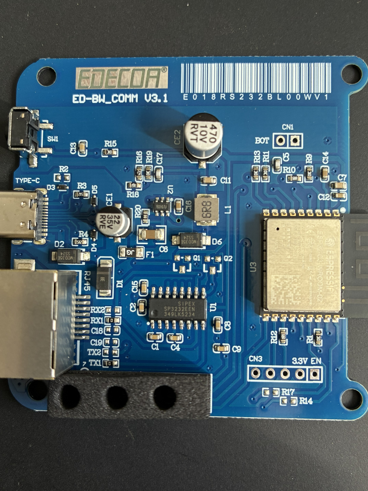
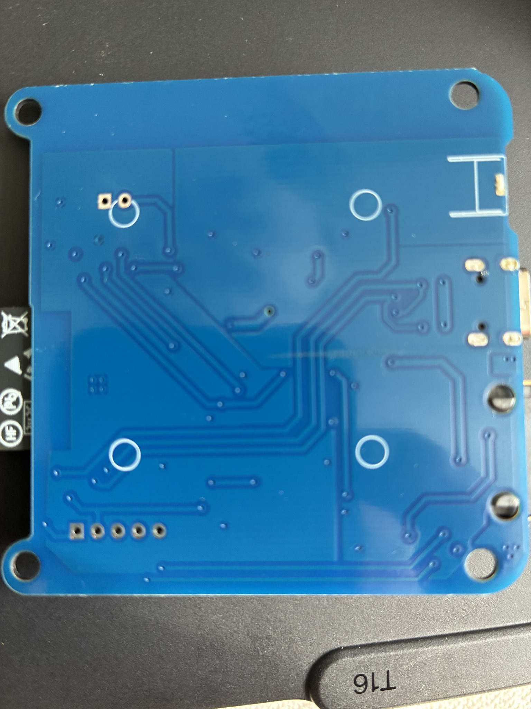
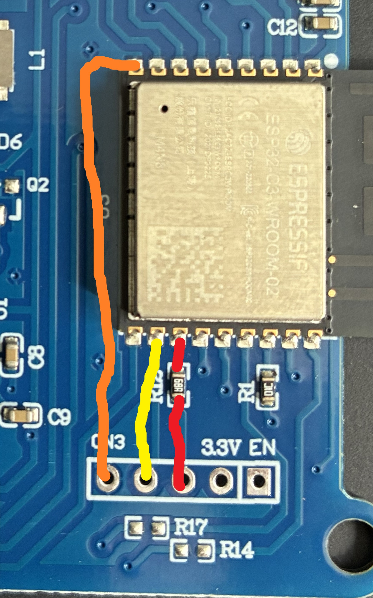
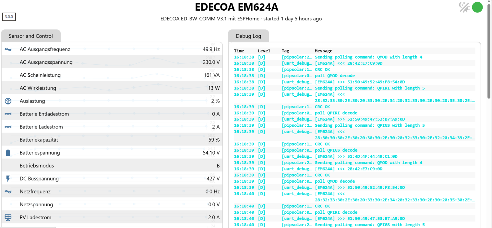
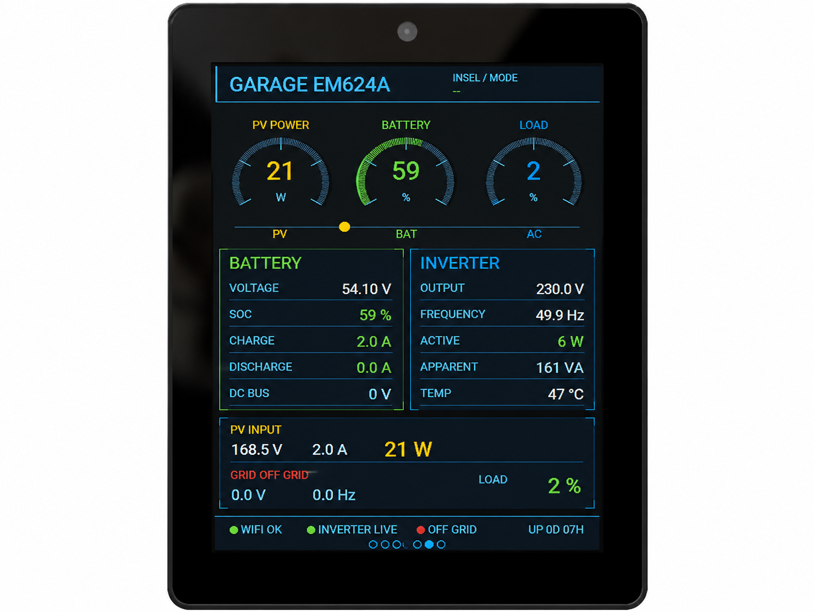

<p align="center">
  
</p>

<h1 align="center">
EDECOA ED-BW_COMM V3.1 ESPHome Firmware
</h1>

<p align="center">

ESPHome firmware for the original **EDECOA ED-BW_COMM V3.1 (ESP32-C3)** WiFi module used with the **EDECOA EM624A** hybrid inverter.

Replace the original cloud firmware and integrate your inverter directly into **Home Assistant**.

</p>

<p align="center">


</p>

---

# Overview

This project replaces the original firmware inside the **EDECOA ED-BW_COMM V3.1 WiFi module** with **ESPHome**.

Communication with the inverter is performed locally using the **Voltronic / PIP protocol** over the original RS232 interface.

No cloud services are required.

---

# Features

✅ ESPHome

✅ Home Assistant Integration

✅ OTA Updates

✅ Local Communication

✅ PIP Protocol

✅ UART Debug

✅ Real-time Sensor Data

---

# Tested Hardware

| Device | Status |
|---------|:------:|
| ED-BW_COMM V3.1 | ✅ |
| ESP32-C3 | ✅ |
| EDECOA EM624A 6.2kW / 48V | ✅ |
| ESPHome | ✅ |
| Home Assistant | ✅ |

---

# Hardware

<p align="center">

</p>

Original EDECOA ED-BW_COMM V3.1 PCB.

### Rear Side

<p align="center">

</p>

### PCB Details

<p align="center">

</p>

---

# Confirmed UART Configuration

| Signal | GPIO |
|--------|------|
| TX | GPIO4 |
| RX | GPIO5 |

Serial Parameters

```
2400 Baud
8 Data Bits
No Parity
1 Stop Bit
```

Confirmed using live **QPI** and **QPIRI** responses.

---

# Architecture

```text
             Home Assistant
                    ▲
                    │ API
                    │
              ESPHome Firmware
                    ▲
                    │
           ESP32-C3 (ED-BW_COMM)
                    │
              RS232 / PIP
                    │
            EDECOA EM624A
```

---

# ESPHome Web Interface

<p align="center">

</p>

Features shown:

- Live inverter values
- UART Debug
- OTA Updates
- Web Server

---

# Energy Control Center Example

This firmware is also used in a custom ESPHome based **Energy Control Center (ECC)**.

<p align="center">

</p>

The ECC integrates:

- EDECOA EM624A
- JK-BMS
- Victron
- Hoymiles
- Zendure
- go-e Charger

---

# Installation

## 1. Backup Original Firmware

```
python -m esptool -p COM7 read-flash 0x000000 0x800000 backup.bin
```

Store your backup safely.

---

## 2. Copy ESPHome Configuration

```
esphome/edecoa-edbw.yaml
```

into your ESPHome configuration folder.

---

## 3. Create secrets.yaml

```yaml
wifi_ssid: "YOUR_WIFI"
wifi_password: "YOUR_PASSWORD"
fallback_password: "CHANGE_ME"
```

---

## 4. Flash via USB

The first installation must be done via USB.

Future updates can be performed using OTA.

---

# Repository Structure

```
docs/
 └── images/

esphome/

home-assistant/

tools/
 └── uart-finder/
```

---

# Troubleshooting

If the inverter does not respond, verify:

- GPIO4 = TX
- GPIO5 = RX
- 2400 Baud
- RJ45 cable connected correctly
- ESPHome logger baud rate disabled (`baud_rate: 0`)

---

# Disclaimer

This project is **not affiliated with EDECOA**.

Flashing custom firmware replaces the original firmware.

Use at your own risk.

Always create a backup before flashing.

---

# Contributing

Issues, pull requests and hardware test reports are welcome.

If you test another EDECOA inverter model, please include:

- inverter model
- ESPHome version
- board revision
- UART logs
- photos (if possible)

---

# License

MIT License