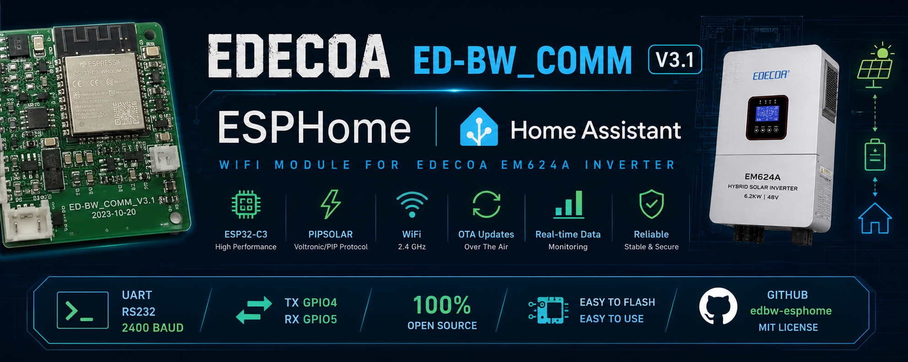

<p align="center">
  
</p>

# EDECOA ED-BW_COMM V3.1 – ESPHome firmware

Open ESPHome firmware for the original **EDECOA ED-BW_COMM V3.1** Wi-Fi dongle used with the **EDECOA EM624A** inverter.

The original dongle contains an **ESP32-C3**, an onboard **SP3232 RS232 transceiver**, USB-C, Wi-Fi and an RJ45 connector. This project replaces the cloud firmware with ESPHome and exposes the inverter directly to Home Assistant.

## Confirmed hardware and protocol

| Item | Value |
|---|---|
| Dongle | EDECOA ED-BW_COMM V3.1 |
| MCU | ESP32-C3 |
| Flash | 8 MB |
| USB | Native USB-Serial/JTAG |
| RS232 transceiver | SP3232 |
| Inverter UART TX | GPIO4 |
| Inverter UART RX | GPIO5 |
| Serial settings | 2400 baud, 8N1 |
| Protocol | Voltronic/PIP |
| Tested inverter | EDECOA EM624A 6.2 kW / 48 V |

The UART mapping was verified with live `QPI` and `QPIRI` responses:

```text
QPI   -> (PI30
QPIRI -> (230.0 30.4 230.0 50.0 ... 6200 ...
```

## Important warning

Flashing ESPHome replaces the original EDECOA firmware.

Before flashing:

1. Make a complete 8 MB backup.
2. Store the backup safely and privately.
3. Do not publish the original firmware image.
4. Work on the low-voltage dongle only.
5. Installation and modification are at your own risk.

The inverter contains dangerous voltages. Do not open or modify the inverter itself unless you are qualified to do so.

## Repository contents

```text
edbw-esphome/
├── esphome/
│   ├── edecoa-edbw.yaml
│   └── secrets.example.yaml
├── tools/
│   └── uart-finder/
│       └── edbw_uart_finder.ino
├── docs/
│   ├── backup-and-restore.md
│   ├── flashing.md
│   ├── hardware.md
│   └── troubleshooting.md
├── home-assistant/
│   └── example-dashboard.yaml
├── LICENSE
└── README.md
```

## 1. Back up the original firmware

First determine the flash size:

```cmd
python -m esptool -p COM7 flash-id
```

For the confirmed 8 MB device:

```cmd
python -m esptool -p COM7 read-flash 0x000000 0x800000 edbw_backup.bin
```

Verify that the backup is exactly 8,388,608 bytes.

## 2. Flash ESPHome

Copy:

```text
esphome/edecoa-edbw.yaml
```

to your ESPHome configuration folder and create the matching secrets:

```yaml
wifi_ssid: "YOUR_WIFI"
wifi_password: "YOUR_PASSWORD"
fallback_password: "CHANGE_ME_123"
```

Compile and install by USB.

## 3. Connect to the inverter

Plug the original ED-BW RJ45 connector into the EM624A.

Expected log traffic:

```text
>>> QPIGS...
<<< (000.0 00.0 230.0 49.9 ...
>>> QPIRI...
<<< (230.0 30.4 230.0 50.0 ...
```

Home Assistant should then receive values such as:

- AC output voltage and frequency
- active and apparent power
- battery voltage and SOC
- charge and discharge current
- PV voltage, current and power
- inverter temperature
- inverter operating mode

## Restoring the original firmware

```cmd
python -m esptool -p COM7 erase-flash
python -m esptool -p COM7 write-flash 0x000000 edbw_backup.bin
```

Use only your own backup from your own device.

## Status

Confirmed working:

- ESP32-C3 USB flashing
- GPIO4/GPIO5 inverter UART
- 2400 baud PIP communication
- ESPHome `pipsolar`
- Home Assistant entities
- OTA updates after first USB flash

## Contributing

Hardware revisions may differ. Open an issue or pull request with:

- board revision
- clear PCB photos
- UART scan result
- inverter model
- ESPHome version
- relevant logs with secrets removed

## License

MIT for the source code and documentation in this repository.

The original EDECOA firmware is not included and is not covered by this license.
